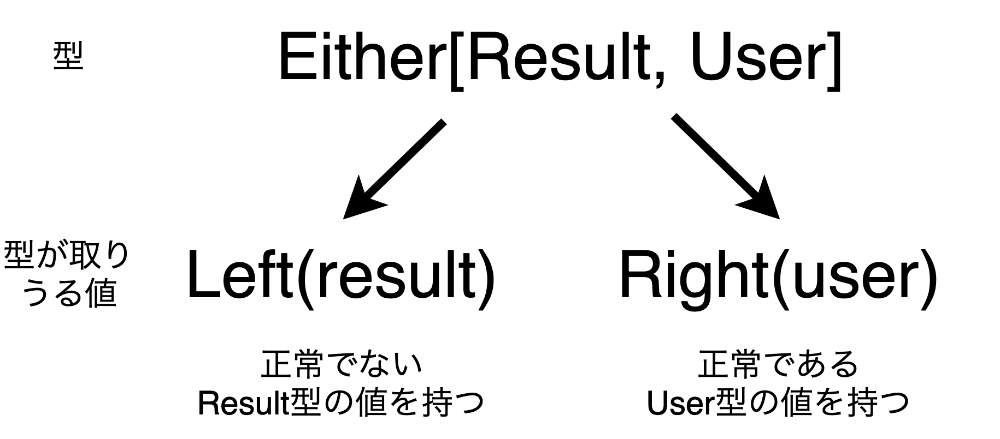

<!--
headingDivider: 1
page_number: true
-->

# OptionとEitherによるログイン処理のエラーハンドリングを検討

# 自己紹介
## 名前
- 久代太一（クシロタイチ）

## 会社
- 株式会社ネクストビートの20新卒エンジニア
- 「KIDSNA キズナコネクト」という保育園の業務支援SaaSの開発に従事
- 労務管理機能があるので、労基法周りのドメインロジック多め

# 自己紹介
## 技術
- 学生時代
  - 研究でPythonを用いた数理最適化と機械学習（領域は物流。通称、オペレーションズリサーチ）
  - 個人でGo, React
- 社会人
  - 業務はScala(Play Framework), TypeScript(Angular, RxJS)
  - 個人でHaskell, オブジェクト指向, DDD, 圏論, アジャイル, Vim, Go, Rust, インタプリンタ

# 自己紹介
## Scala歴
- 去年の12月から本格的に勉強開始で半年強
- プロダクト開発寄り
- とにかくScalaが好き

# 今日のテーマ
### OptionとEitherによるログイン処理のエラーハンドリングを検討

# 今日のテーマ
- プロダクト開発でのOption, Eitherの使用例を、ログイン処理を題材に紹介
- 「Scalaの文法・標準ライブラリを学んだ！けどどう活かせばいい？」という方向け
- Scalaの文法・機能を一切知らない方
  - 「こんなことができるんだな〜」くらいの参考程度に
- 経験豊富な方
  - 自分が初学者に説明するならこうする等の改善点があれば

# ログイン処理のエラーハンドリング

# エンティティ定義
```scala
// User.Idは別途定義されているものとする
case class User(
  id:   Option[User.Id], 
  name: String  
)
// Userと一対一の関係を持つ
case class UserPassword(
  userId:   User.Id,
  password: String
)
```

<!--
- これらの定義は簡略化している
- Userクラスはidとname
- UserPasswordクラスはidとpassword
- DBのテーブル定義も同じ構成
-->

# 処理の流れを整理
1. ユーザーから`name`と`password`の入力を受け取る
2. 受け取った`name`を用いて、`User`クラスインスタンス（以下、`user`）を取得する処理を行う
3. `user`を取得できたかどうかのエラーハンドリングを行う
4. 取得した`user`の`id`によって`UserPassword`クラスインスタンス（以下、`userPassword`）を取得する処理を行う
5. 取得した`userPassword`の`password`と入力で受け取った`password`を比較し、エラーハンドリングを行う
6. パスワードが正しければ、認証処理を行う

# Optionで実装してみる

# Optionの概要（例）


<!--

- 値があるかないかを表す型
- OptionにUser型を渡したユーザーオプション型
- 値がないことを表すNoneオブジェクト
- 値があることを表すSomeクラスインスタンス
- SomeクラスインスタンスはUser型の値を持ち、値を取り出す処理が用意されている

-->

# DBから値を取得するメソッド
```scala
// User型の値を取得
def getByName(name: String): Future[Option[User]] = ???

// UserPassword型の値を取得
def get(userId: User.Id):    Future[Option[UserPassword]] = ???
```
<!--
- 今回サンプルコードで使用するDBから値を取得するメソッド
- userテーブルに対応するUser型の値を取得するgetByNameメソッド
- user_passwordテーブルに対応するUserPassword型の値を取得する
- Futureには触れない

-->

# DBから値を取得する処理の例
```scala
// コントーラー内処理
for {
  userOpt: Option[User] <- userDao.getByName(name)
} yield println(userOpt) // userOptを出力

// User型の値が見つかった場合
// Some(User(id = Some(1), name = "yaga"))

// User型の値が見つからなかった場合
// None
```

# コントローラー処理（Option ver）
```scala
(login: LoginFormData) => {
  for {
    userOpt: Option[User] <- userDao.getByName(login.name)
    result                <- userOpt match {
      case None       => Future.successful(NotFound("not found name"))
      case Some(user) =>
        for {
          Some(userPassword) <- userPasswordDao.get(user.withId)
          result             <- userPassword.verify(login.password) match {
            case false => Future.successful(Unauthorized("invalid password"))
            case true  => authMethods.loginSuccess(user, Redirect(homeUrl))
          }
        } yield result
    }
  } yield result
}
```

# Optionで書いた場合
- ネストが深くて読みづらい
- これ以上処理が増えるとエラーハンドリング処理が書きにくい
- `None`はあくまで**値がない**という情報しか持たない

<!--
- DBから取得したらチェック。その値を使って次の値を取得...でネストが深くなる
- エラーハンドリング処理が書きにくい
-->

# Eitherで実装してみる

# Optionの概要（例）


# Eitherの概要（例）


<!--
- Optionに比べて、正常でないどんな値を持たせるか
- Either型に与える一つ目の引数が正常でない場合の値の型
- 二つ目の引数が正常な場合に返す値の方
- Option型に比べて正常でない時の情報が増える
-->

# DBから値を取得する処理の例
```scala
// コントーラー内処理
for {
  userOpt:    Option[User]         <- userDao.getByName(name)
  userEither: Either[Result, User]  = userOpt.toRight(NotFound("not found name"))
} yield println(userEither) // userEitherを出力

// User型の値が見つかった場合
// Right(User(id = Some(1), name = "yaga"))

// User型の値が見つからなかった場合
// Left(NotFound("not found name"))
```

<!--
- Option型の値が持つ、topRightメソッドに正常でないの値を与えることでEitherに変換できる
- Someの場合はそのままRightに、Noneの場合は引数に与えた値をLeftに変換する
-->

# コントローラー処理（Either ver）
```scala
(login: LoginFormData) => {
  for {
    userOpt:    Option[User]         <- userDao.getByName(login.name)
    userEither: Either[Result, User]  = userOpt.toRight(NotFound("not found name"))
    userPasswordEither: Either[Result, UserPassword] <-
      userEither match {
        case Left(l)     => Future.successful(Left(l))
        case Right(user) => userPasswordDao.get(user.withId).map(_.toRight(NotFound))
      }
    result <- userPasswordEither match {
      case Left(l)             => Future.successful(l)
      case Right(userPassword) =>
        userPassword.verify(login.password) match {
          case false => Future.successful(Unauthorized("invalid password"))
          case true  => authMethods.loginSuccess(userOpt.get, Redirect(homeUrl))
        }
    }
  } yield result
}
```

<!--

- userEitherが正常でない場合はそのままLeftを引き継ぐ
- 毎回エラーハンドリングした結果のEither型の値を精製して、次の処理にEither型の値を用いる

-->

# Eitherで書いた場合
- ネストが浅くなった
- これ以上処理が増えてもエラーハンドリング処理を書きやすい
- `Left`により**どんなエラーが起きたか**という情報を持つ

<!--
- 処理を終えるとEitherの変換
- Eitherを使って次の処理へ、ネストせずにエラー情報を保持する
-->

# CatsのEitherTで書いた場合（番外編）
```scala
(login: LoginFormData) => {
  val result: EitherT[Future, Result, Result] =
    for {
      user         <- EitherT(userDao.getByName(login.name).map(_.toRight(NotFound("not found name"))))
      userPassword <- EitherT(userPasswordDao.get(user.withId).map(_.toRight(NotFound)))
      result       <- EitherT(
        userPassword.verify(login.password) match {
          case false => Future.successful(Left(Unauthorized("invalid password")))
          case true  => authMethods.loginSuccess(user, Redirect(homeUrl)).map(Right(_)):w

        }
      )
    } yield result

  result.merge
}
```

# まとめ

# Scalaを学ぶにあたってやったこと（上から順）
- ドワンゴ研修資料
- Tour of Scala
- [Output] Todoアプリ作成
- N予備校基礎・応用
- 実践Scala入門
- 入社した会社の研修資料（標準ライブラリのメソッドを学ぶ）
- Scalaの標準ライブラリを読む
- [Output] Todoアプリ作成（２回目）

# アウトプットするときにサンプルコードが欲しい

# 初学者向けのベースプロジェクトを作りました

### [https://github.com/taichi0315/scala-play-auth-sample](https://github.com/taichi0315/scala-play-auth-sample)

# ベースプロジェクト概要
- 今日の発表資料のサンプルコードを含む
- Play Frameworkを使用
- 簡易的なユーザー認証処理ができる状態
- defaultブランチはあえて標準ライブラリのみで実装
- ブランチを切り替えると色々な実装パターンが
  - Option <-> Either <-> EitherT
  - for yield <-> flatMap, map
- イシューに改善点を列挙してある
  - コメント・イシュー追加歓迎します！
- 自分のコードが正解ではないので参考程度に

# 楽しいScalaライフを！