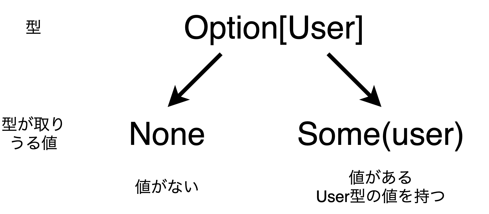
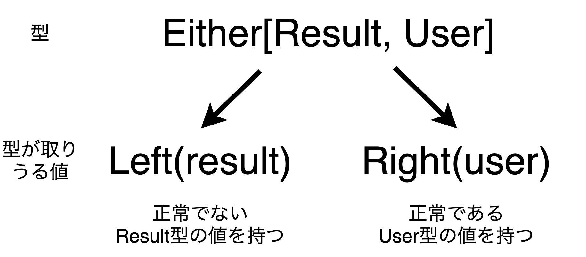

<!--
headingDivider: 1
-->

# OptionとEitherによるログイン処理のエラーハンドリングを検討

# 自己紹介
## 名前
- 久代太一（クシロタイチ）

## 会社
- 株式会社ネクストビートの20新卒エンジニア
- キズナコネクトという保育園の業務支援SaaS
- 労務管理機能があるので、労基法周りのドメインロジック多め

# 自己紹介
## 技術
- 学生時代
  - 研究でPythonを用いた数理最適化と機械学習（領域は物流。通称、オペレーションズリサーチ）
  - 個人でGo, React
- 社会人
  - 業務はScala(Play Framework), TypeScript(Angular, RxJS)
  - 個人でHaskell, オブジェクト指向, DDD, 圏論, アジャイル, Vim, Go, Rust, インタプリンタ...

# 自己紹介
## Scala歴
- 去年の12月から本格的に勉強開始で半年強
- プロダクト開発寄り
- とにかくScalaが好き

<!--
# 今日のテーマ
## Scala初学者がつまずきがちなところは？
- Option, Either, Future, Try
  - 値の操作方法を覚える
- for yield式
  - map, flatMapとの対応
- match式
  - switch式との違いは？
- apply, unapply
  - DBやフォームとのマッピング?
- case class, object, trait, companion object
  - どのように使い分ける?
-->

# 今日のテーマ
### ログイン処理のエラーハンドリングにおけるOptionとEitherの使用法を検討する

# 今日のテーマ
- Scalaの機能を学んだ！は良いけどどう活かせばいい？
- Option, Either（Future, Try）の扱いに慣れたい
- 馴染みのあるログイン処理でOptionとEitherについて議論しよう！

# 対象別の発表の目的
## 全くのScala初学者の方
- こういう便利な機能があるんだな〜

## Scalaの文法を学んだが開発の経験がない方（一番参考になる？）
- Scalaの機能が実際にどう開発に用いられているかの例を知る

## 開発経験が豊富な方
- 自分が初学者に説明するのであればこうする等の改善点があれば

# ログイン処理のエラーハンドリング

# テーブル定義
- user
  - id
  - name
- user_password
  - user_id (idと対応)
  - password

# 処理の流れを整理
1. ユーザーから`name`と`password`の入力を受け取る
2. 入力で受け取った`name`によってDBから`user`インスタンスを取得
3. `user`が取得できたかどうかのエラーハンドリング
4. `user.id`によって`userPassword`インスタンスを取得
5. `userPassword.password`と入力で受け取った`password`を比較し、`password`が正しいかのエラーハンドリング
6. 全て正常であれば認証処理を行う

# Optionで実装してみる

# Optionの概要（例）


# DBから値を取得するメソッド
```scala
// User型の値を取得
def getByName(name: String): Future[Option[User]] = ???

// UserPassword型の値を取得
def get(userId: User.Id): Future[Option[Userpassword]] = ???
```

# DBから値を取得する処理の例
```scala
// コントーラー内処理
for {
  userOpt: Option[User] <- userDao.getByName(name)
  _                     <- Future.successful(println(userOpt))
} yield ...

// User型の値が見つかった場合
// Some(User(id = Some(1), name = "yaga"))

// User型の値が見つからなかった場合
// None
```

# コントローラー処理（Option ver）
```scala
(login: LoginFormData) => {
  for {
    userOpt: Option[User] <- userDao.getByName(login.name)
    result:  Result       <- userOpt match {
      case None       => Future.successful(NotFound("not found name"))
      case Some(user) =>
        for {
          Some(userPassword) <- userPasswordDao.get(user.withId)
          result: Result     <- userPassword.verify(login.password) match {
            case false => Future.successful(Unauthorized("invalid password"))
            case true  => authMethods.loginSuccess(user, Redirect(homeUrl))
          }
        } yield result
    }
  } yield result
}
```

# Optionで書いた場合
- ネストが深くて読みづらい
- これ以上処理が増えるとエラーハンドリング処理が書きにくい
- `None`はあくまで**値がない**という情報しか持たない

# Eitherで実装してみる

# Eitherの概要（例）


# Option型からEither型への変換
scalaリポジトリ内の`Option.scala`より
```scala
@inline final def toRight[X](left: => X): Either[X, A] =
  if (isEmpty) Left(left) else Right(this.get)
```

# DBから値を取得する処理の例
```scala
// コントーラー内処理
for {
  userOpt:    Option[User]         <- userDao.getByName(name)
  userEither: Either[Result, User]  = userOpt.toRight(NotFound("not found name"))
  _                                <- Future.successful(println(userEither))
} yield ...

// User型の値が見つかった場合
// Right(User(id = Some(1), name = "yaga"))

// User型の値が見つからなかった場合
// Left(NotFound("not found name"))
```

# コントローラー処理（Either ver）
```scala
(login: LoginFormData) => {
  for {
    userOpt:    Option[User]         <- userDao.getByName(login.name)
    userEither: Either[Result, User]  = userOpt.toRight(NotFound("not found name"))
    userPasswordEither: Either[Result, UserPassword] <-
      userEither match {
        case Left(l)     => Future.successful(Left(l))
        case Right(user) => userPasswordDao.get(user.withId).map(_.toRight(NotFound))
      }
    result: Result <- userPasswordEither match {
      case Left(l)             => Future.successful(l)
      case Right(userPassword) =>
        userPassword.verify(login.password) match {
          case false => Future.successful(Unauthorized("invalid password"))
          case true  => authMethods.loginSuccess(userOpt.get, Redirect(homeUrl))
        }
    }
  } yield result
}
```

# Eitherで書いた場合
- ネストが浅くなった
- これ以上処理が増えてもエラーハンドリング処理を書きやすい
- `Left`により**どんなエラーが起きたか**という情報を持つ

# EitherTで書いた場合（番外編）
```scala
(login: LoginFormData) => {
  val result: EitherT[Future, Result, Result] =
    for {
      user         <- EitherT(userDao.getByName(login.name).map(_.toRight(NotFound("not found name"))))
      userPassword <- EitherT(userPasswordDao.get(user.withId).map(_.toRight(NotFound)))
      result       <- EitherT(
        userPassword.verify(login.password) match {
          case false => Future.successful(Left(Unauthorized("invalid password")))
          case true  => authMethods.loginSuccess(user, Redirect(homeUrl)).map(Right(_)):w

        }
      )
    } yield result

  result.value.map {
    case Left(l)  => l
    case Right(r) => r
  }
}
```

# まとめ

# Scalaを学ぶにあたってやったこと
- ドワンゴ研修資料
- Tour of Scala
- [Output] Todoアプリ作成
- N予備校基礎・応用
- 実践Scala入門
- 入社した会社の研修資料（標準ライブラリのメソッドを学ぶ）
- Scalaの標準ライブラリを読む
- [Output] Todoアプリ作成（２回目）

# アウトプットするときにサンプルコードが欲しい

# 初学者向けのベースプロジェクトを作りました

### [https://github.com/taichi0315/scala-play-auth-sample](https://github.com/taichi0315/scala-play-auth-sample)

# ベースプロジェクト概要
- Play FrameWorkを使用
- 簡易的なユーザー認証処理ができる状態
- defaultブランチはあえて標準ライブラリのみで実装
- ブランチを切り替えると色々な実装パターンが
  - Option <-> Either <-> EitherT
  - for yield <-> flatMap, map
- イシューに改善点を列挙してある
  - コメント・イシュー追加歓迎します！
- 自分のコードが正解ではないので参考程度に

# 楽しいScalaライフを！