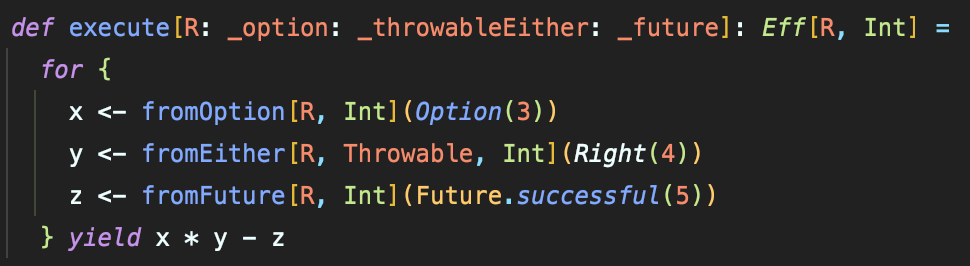
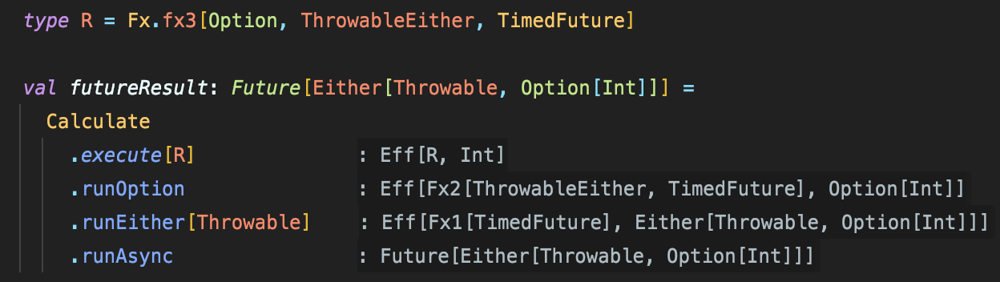
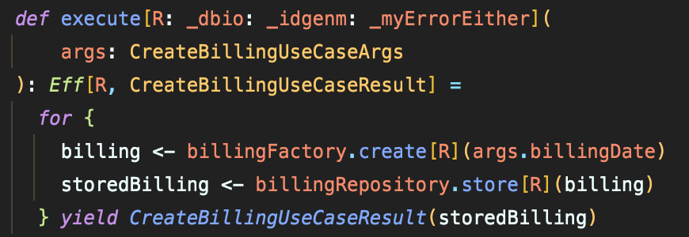

# Eff（atnos-eff）による実践的なコーディング集

Kushiro Taichi at Alp,Inc.

---

## 自己紹介

- Kushiro Taichi ( shiroichi315 )
- アルプ株式会社 2021.06 ~
- キーワード
  - Scala
  - DDD
  - Agile
  - FP
  - Tortoiseshell


---

## Eff（Extensible Effects）とは
- 「Freer Monads, More Extensible Effects」で紹介
- 実装面の特徴
  - 複数のエフェクトをフラットに扱う
  - Interpreterによる実行の分離

---

## 複数のエフェクトをフラットに扱う
- for式に含まれるエフェクトを型パラメータで受け取る
- スマートコンストラクタによって `Eff[R, A]`型に変換



--- 

## Interpreterによる実行の分離
- Open Unionによりエフェクトのスタックを定義
- Interpreterによる実行



---

# 実務のコードでは...？
- 例としてファクトリやリポジトリにエフェクトを用いることも
- `Eff[R, A]`型を複数のメソッドで引き回すことが多い



---

# コーディング集

実務に近いコードを紹介していきます

---

## map
```scala
for {
  providerIdAndBillingIds <- billingRepository
    .findByIds[R](billingIds)
    .map(billings => (providerId, billings))
  ...
} yield 

```

---

pureEff[R, A]

---

traverse, sequence

---

validated -> runNel

---

runPure

---

コーディングレベルでの悩みポイント
- どのタイミングでEff[R, A]に変換するか
- flatMapのコンテキスト指定
- option, list effect使う？


---

メリット
- ドメインに集中できる
  - 日々の業務で技術的関心事を意識することが減る
  - シグネチャに現れるエフェクトによって可読性が増す
- 学習コストが低い?（基盤が整っている前提）
  - モナトラで組み合わせる方が難しい
  - API見に行く回数は少ない

---

アルプ独自の書き方

---

# To Be Continued...


---