# Eff（atnos-eff）による実践的なコーディング集

Kushiro Taichi at Alp,Inc.

---

## 自己紹介

- Kushiro Taichi ( shiroichi315 )
- アルプ株式会社 2021.06 ~
- キーワード
  - Scala
  - DDD
  - Agile
  - FP
  - Tortoiseshell

---

## Eff（Extensible Effects）とは
- 「Freer Monads, More Extensible Effects」で紹介
- 実装面の特徴
  - 複数のエフェクトをフラットに扱う
  - Interpreterによる実行の分離

---

## 複数のエフェクトをフラットに扱う
- for式に含まれるエフェクトを型パラメータで受け取る
- スマートコンストラクタによって `Eff[R, A]`型に変換

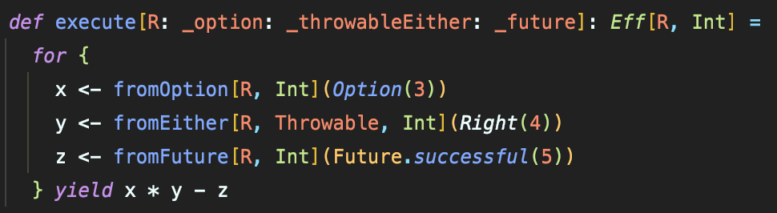

--- 

## Interpreterによる実行の分離
- Open Unionによりエフェクトのスタックを定義
- Interpreterによる実行

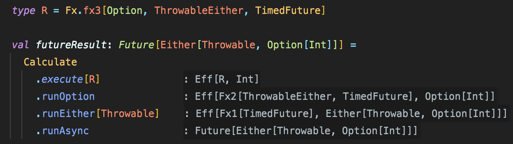

---

## 実務のコードでは...？
- 例として`Factory`や`Repository`にエフェクトを用いることも
- `Eff[R, A]`型を複数のメソッドで引き回すことが多い

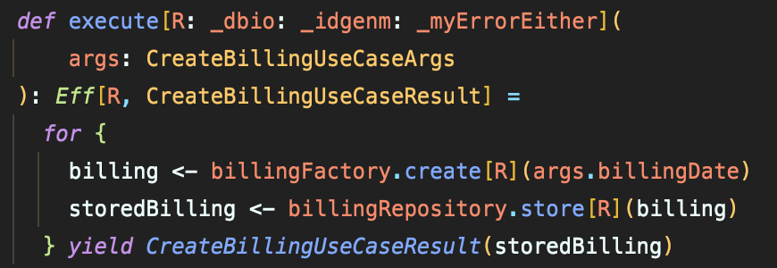

---

# コーディング集

実務に近いコードを紹介していきます

---

## map
- `A`型の値に関数を適用

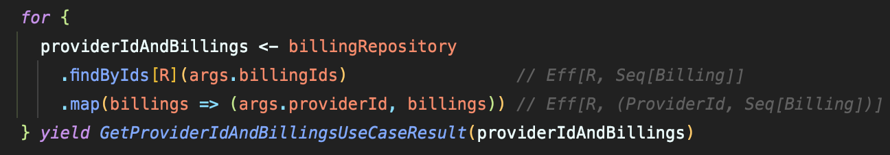

---

## pureEff
- pureな `A` 型の値を `Eff[R, A]`型に変換

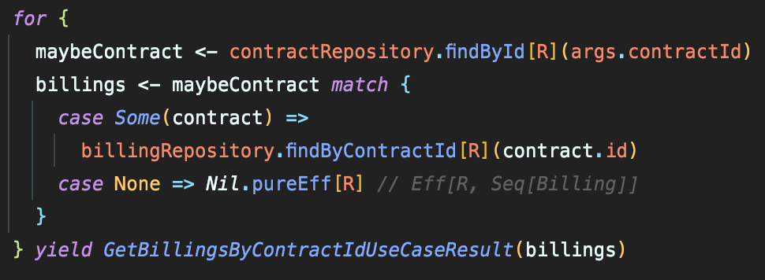

---

## traverseA
- `Eff[R, A]`型を返す処理を走査する
- `sequenceA`も存在

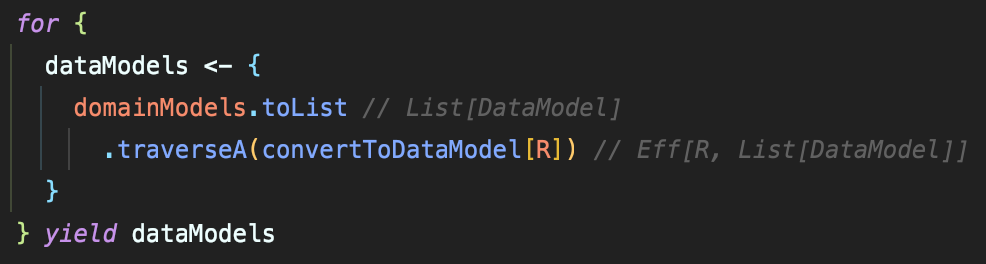

---

runPure

---

# コーディングレベルでの悩みポイント

---

## flatMapのコンテキスト指定
- for式の最初の処理の型にコンテキストが束縛される

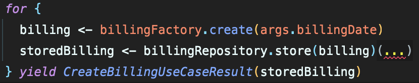
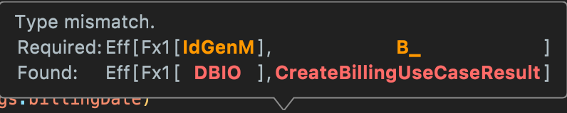

---

## どのタイミングでEff[R, A]に変換するか
- テストが煩雑になることも
- ドメインロジックはピュアに書く？

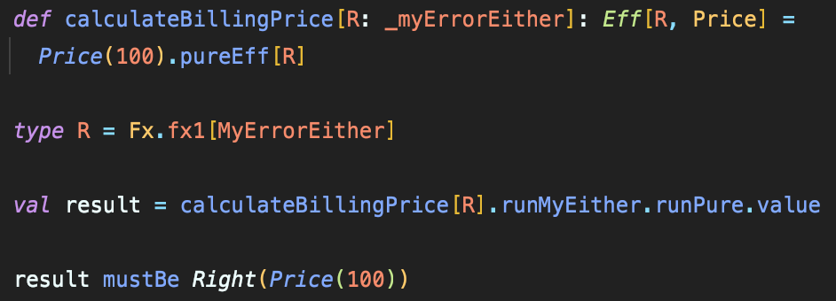

---

## option, list エフェクトを用いるか
- `runXxx`によって実行順を制御
- 処理に対する実行順の意識が必要になり基本的には使っていない

---

## 実行の配線問題
- 一つのエフェクト実行で別のエフェクトが展開されることも
- 展開される順序通りの実行が必要
- 例: `TransactionTask` -> `MyError`・ `Task`

---

## 実装を意識しなくなるが実装知識も大事
- DBのトランザクションどうなってる？

---

# とはいえ個人・会社的にもEffはポジティブ

---

## ドメインに集中できる
- 
- 実装がカプセル化される
- シグネチャに現れるエフェクトによって可読性が増す

---

## 学習コストが低い（という見方もできる）
  - モナトラの型合わせの方が脳のメモリを使う印象
  - 覚えるAPIの数は少ない
  - チーム内に理論含め詳しい人は必要

---

# アルプ独自の実装

---
## 独自エフェクトが多数用いられている
- ID生成
- DBトランザクション
- Kinesis実行 etc.

---

## 独自エラーエフェクトに対するスマートコンストラクタを多数定義

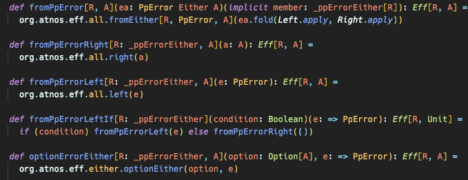

---

# To Be Continued...

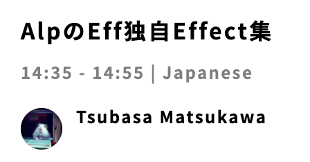
