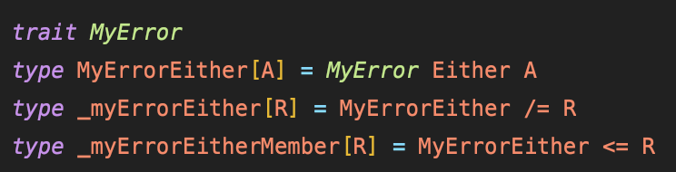
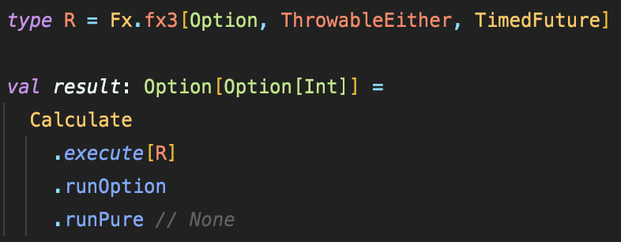
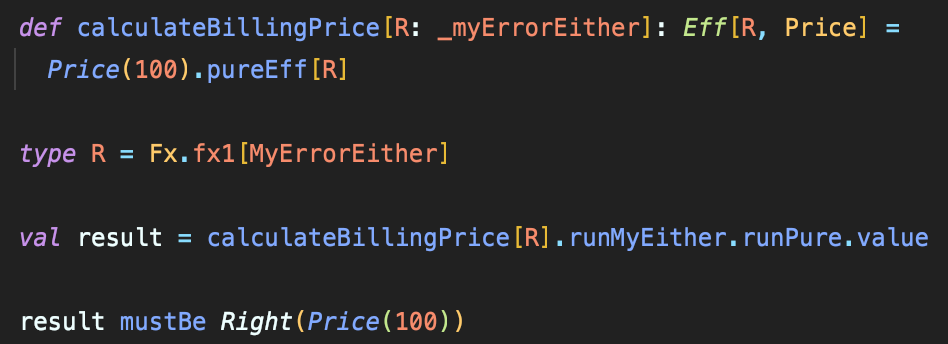

# Eff（atnos-eff）による実践的なコーディング集

Kushiro Taichi at Alp,Inc.

---

## 自己紹介

- 久代 太一 ( shiroichi315 )
- アルプ株式会社 2021.06 ~
- キーワード
  - Scala, DDD, Agile, FP
- その他
  -  Tortoiseshell, Tsukemen, Sauna, Bouldering

---

## Eff（Extensible Effects）とは
- 「Freer Monads, More Extensible Effects」の論文で紹介
  - Efficient Freer, Open Union
- 「Extensible Effects in Scala」- ねこはるさんの記事

---

## Eff（Extensible Effects）の実装
- atnos-effライブラリを用いる
- 実装時の特徴
  - 複数のエフェクトをフラットに扱う
  - Interpreterによる実行の分離
  - 独自エフェクトの定義が可能

---

## 複数のエフェクトをフラットに扱う
- for式に含まれるエフェクトを型パラメータで受け取る
- スマートコンストラクタによって `Eff[R, A]`型に変換

--- 

## Interpreterによる実行の分離
- Open Unionによりエフェクトのスタックを定義
- Interpreterによる実行
- 実行順により型の結果が変わる - 値の結果は変わらない

---

## 独自エフェクトの定義が可能
- エフェクト定義
- スマートコンストラクタ
- Interpreter - 差し替え可能

---

# コーディング集

実務に近いコードを紹介していきます

---

## 実務のコードでは...？
- 例として`Factory`や`Repository`内でエフェクトを用いることも
- `Eff[R, A]`型を複数のメソッドで引き回すことが多い

---

## map
- `A`型の値に関数を適用

---

## pureEff
- pureな `A` 型の値を `Eff[R, A]`型に変換

---

## traverseA
- `Eff[R, A]`型を返す処理を走査する
- `sequenceA`も存在

---

## runPure
- `Eff[R, A]`から`A`を `Option`で囲んで取り出す
  - エフェクトスタックが空であれば `Some`、空でなければ `None`
- 空かどうかは式に依存しmock（pureEff）はエフェクトスタックに含まれない

---

# コーディングレベルでの悩みポイント

---

## flatMapのコンテキスト指定
- for式の最初の処理の型にコンテキストが束縛される

---

## どのタイミングでEff[R, A]に変換するか
- テストが煩雑になることも
- ドメインロジックはピュアに書く？

---

## option, list エフェクトを用いるか
- `runXxx`によって実行順を制御
- 処理に対する実行順の制御に気をつける

---

## 実行の配線問題
- 一つのエフェクト実行で別のエフェクトが展開されることも
- 展開される順序通りの実行が必要
- 例: `TransactionTask` -> `MyError`・ `Task`

---

## 実装をカプセル化はするが実装知識も大事
- DBのコネクション、セッションどうなってる？

---

# とはいえ個人・会社的にもEffはポジティブ

---

## ドメインに集中できる
- 実装がカプセル化されユースケースの見通しが良くなる
- シグネチャに現れるエフェクトによって可読性が増す
  - ユースケースに対して発生するエフェクトが把握できる

---

## 学習コストが低い（という見方もできる）
  - モナトラの型合わせの方が脳のメモリを使う印象
  - 覚えるAPIの数は少ない
  - チーム内に理論含め詳しい人は必要

---

# アルプ独自の実装

---
## 独自エフェクトが多数用いられている
- 独自エラー型
- ID生成
- DBトランザクション（doobie公式） etc.

---

## 独自エラーエフェクトに対するスマートコンストラクタを多数定義

---

# To Be Continued...

---
参考リンク
- atnos-eff公式チュートリアル
  - https://atnos-org.github.io/eff/
- Freer Monads, More Extensible Effects
  - https://okmij.org/ftp/Haskell/extensible/more.pdf
- Extensible Effects in Scala
  - https://halcat.org/scala/extensible/index.html
- Scala + CleanArchitecture に Eff を組み込んでみた
  - https://tech.recruit-mp.co.jp/server-side/post-18728/
